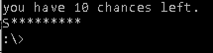

# HangMan
*This is a tiny hangman game in C99*.

This program is only a test, just for fun so it may contains ugly things,
moreover every game function are on the `main.c`,
nothing has been sorted, and sorry for that ;p

## Download

You can download executable version of the hangman game.
Latest version available below.

| OS / Archi | 32 bit | 64 bit | Arm-v6 | PowerPc G6 |
|------------|--------------------------------|--------------------------------|--------------------------------|--------------------------------|
| Windows    | | [HangMan.zip](bin/HangMan.zip) | |
| Linux      | | [HangMan.tar.xz](bin/HangMan_Linux64.tar.xz) | | [HangMan.tar.xz](bin/HangMan_PPCG6.tar.xz) |
| Mac Os     |

> Click on the link, then clic *Download*
>
> Then, just extract it and enjoy !

## Exemple



## Customize
You may add word to the file 'dico.txt', but only on **UPPERCASE**.

## Build your own version from sources
Go to the project folder.

```bash
cmake ./    #Will use the file CMakeList.txt
make        #Compile program
```
